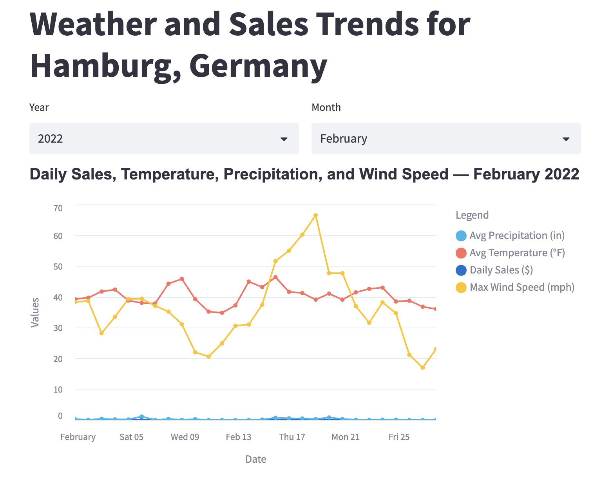

# Tasty Bytes dbt Project — Step-by-Step Guide

## What This Project Does

This is a dbt (data build tool) project that transforms raw Tasty Bytes food truck data and Frostbyte WeatherSource marketplace data in Snowflake into analytics-ready tables.

The central question: **Why did the Hamburg, Germany food truck underperform in February 2022?**

The project answers this by joining sales data with weather data (temperature, precipitation, wind speed) and delivering the combined dataset as a clean, queryable gold table.

---

## Project Architecture

```
S3 (Tasty Bytes orders)      Snowflake Marketplace (Weather)
         │                              │
         ▼                              ▼
   RAW_POS / RAW_CUSTOMER     FROSTBYTE_WEATHERSOURCE
         │                              │
         └──────────┬───────────────────┘
                    ▼
             Bronze  (views)       ← source wrappers
             Silver  (incremental) ← cleaned & joined
             Gold    (incremental) ← business aggregates
                    │
                    ▼
          Streamlit in Snowflake
```

### Model Lineage

```
bronze_order_header ─┐
bronze_order_detail  ├─► silver_orders ──────────────────────┐
bronze_truck         │                                        ├─► gold_daily_sales_hamburg
bronze_menu          │                                        ├─► gold_daily_city_metrics
bronze_franchise     │                                        │
bronze_location      ┘                                        │
                                                              │
bronze_weather_history ─┐                                     │
bronze_postal_codes     ├─► silver_daily_weather ─────────────┘
bronze_country          ┘
```

---

## Data Ingestion — Where Does the Raw Data Come From?

### Transactional data (order_header, order_detail)

`order_header` and `order_detail` are **transactional tables** — they record every order placed across all 450 food trucks in real time (OLTP data). In this project there are two ingestion modes:

| Mode | When | How |
|---|---|---|
| **Initial load** | Once, at project setup | `COPY INTO` from a public S3 bucket |
| **Ongoing ingestion** | Every time new orders arrive | **Snowpipe** auto-ingests new S3 files as they land |

All of this is defined in [`analyses/setup_snowflake.sql`](analyses/setup_snowflake.sql). Run it once before your first `dbt run`.

### How Snowpipe works (ongoing ingestion)

```
Food truck POS system
    │  writes new order rows as CSV/JSON
    ▼
S3 bucket  (e.g. s3://your-bucket/raw_pos/order_header/)
    │  S3 event notification (SQS) fires on every new file
    ▼
Snowpipe  (always-on Snowflake service)
    │  COPY INTO tasty_bytes.raw_pos.order_header
    ▼
TASTY_BYTES.RAW_POS.ORDER_HEADER  ← dbt reads from here
```

Snowpipe picks up new files within ~1 minute of them landing in S3. No polling or cron job needed on the ingestion side.

**Pause / resume Snowpipe** (run in Snowflake):
```sql
ALTER PIPE tasty_bytes.public.pipe_order_header PAUSE;
ALTER PIPE tasty_bytes.public.pipe_order_header RESUME;

-- Check status:
SELECT SYSTEM$PIPE_STATUS('tasty_bytes.public.pipe_order_header');
```

### Weather data (FROSTBYTE_WEATHERSOURCE)

This is a **Snowflake Marketplace** dataset — Snowflake syncs it automatically. You import it once from the Marketplace UI; no ingestion pipeline needed.

---

## Prerequisites

1. **Snowflake account** with:
   - `TASTY_BYTES` database set up by running [`analyses/setup_snowflake.sql`](analyses/setup_snowflake.sql) (see Step 1 below)
   - `FROSTBYTE_WEATHERSOURCE` imported from the Snowflake Marketplace
   - Warehouse: `COMPUTE_WH` (or update `profiles.yml`)
   - Role with `CREATE SCHEMA` privileges on `TASTY_BYTES`

2. **dbt Core with Snowflake adapter** installed locally:
   ```bash
   pip install dbt-snowflake
   ```

3. **Python 3.8+** (required by dbt)

---

## Step 1 — Set Up Snowflake (one-time)

Open [`analyses/setup_snowflake.sql`](analyses/setup_snowflake.sql) in Snowflake's worksheet UI (or SnowSQL CLI) and run the whole script. It will:

1. Create the `TASTY_BYTES` database and `RAW_POS` / `RAW_CUSTOMER` schemas
2. Create a warehouse (`COMPUTE_WH`)
3. Create a file format and S3 stage pointing at the public Tasty Bytes bucket
4. Create all raw table DDL (country, franchise, location, menu, truck, order_header, order_detail, customer_loyalty)
5. Run `COPY INTO` to load the initial historical dataset from S3
6. Create Snowpipe pipes for ongoing ingestion of new order data

Also import `FROSTBYTE_WEATHERSOURCE` from the Snowflake Marketplace (search "Weather Source" → "Frostbyte").

---

## Step 2 — Clone the Repo and Configure Connection

Push this project to GitHub and clone it:
```bash
git init
git add .
git commit -m "Initial Tasty Bytes dbt project"
git remote add origin <your-repo-url>
git push -u origin main
```

Open `profiles.yml` and fill in your Snowflake credentials:

```yaml
tasty_bytes:
  outputs:
    dev:
      type: snowflake
      account: <YOUR_ACCOUNT>    # e.g. xy12345.us-east-1
      user: <YOUR_USER>
      password: <YOUR_PASSWORD>
      role: accountadmin
      database: TASTY_BYTES
      warehouse: COMPUTE_WH
      schema: DBT_DEV            # dbt will create this if it doesn't exist
      threads: 4
  target: dev
```

> **Security note:** `profiles.yml` is listed in `.gitignore` so your credentials are never committed. Keep it local.

Test the connection:
```bash
dbt debug
```

You should see `All checks passed!`.

---

## Step 3 — Install dbt Dependencies

```bash
dbt deps
```

This project has no external packages, so this step will complete immediately.

---

## Step 4 — Understand the Schema Layout

The `generate_schema_name` macro (in `macros/generate_schema_name.sql`) overrides dbt's default schema naming so each layer lands in its own Snowflake schema:

| Layer  | Snowflake Schema        | Materialization |
|--------|-------------------------|-----------------|
| Bronze | `TASTY_BYTES.BRONZE`    | View            |
| Silver | `TASTY_BYTES.SILVER`    | View            |
| Gold   | `TASTY_BYTES.GOLD`      | Table           |

dbt creates these schemas automatically on first run.

---

## Step 5 — Run the Full Pipeline

```bash
dbt run
```

This executes all models in dependency order:
1. Bronze views are created/replaced in `TASTY_BYTES.BRONZE`
2. Silver views are created/replaced in `TASTY_BYTES.SILVER`
3. Gold tables are created/replaced in `TASTY_BYTES.GOLD`

To run a single layer:
```bash
dbt run --select bronze.*
dbt run --select silver.*
dbt run --select gold.*
```

To run a single model:
```bash
dbt run --select gold_daily_sales_hamburg
```

---

## Step 6 — Run Data Quality Tests

```bash
dbt test
```

Tests defined in `models/docs/schema.yml`:
- `unique` and `not_null` on key columns (order_id, customer_id, etc.)
- `generic_not_null` — custom generic test in `tests/generic/`

Custom singular test in `tests/`:
- `hamburg_sales_positive.sql` — warns if any day has negative sales

Failed tests are stored in `TASTY_BYTES.DBT_DEV` (or `DBT_PROD`) with `store_failures: true`.

---

## Step 7 — Generate and View Documentation

```bash
dbt docs generate
dbt docs serve
```

Opens a browser with a full data catalog including:
- Column-level descriptions from `models/docs/docs_blocks.md`
- Model descriptions from `models/docs/schema.yml`
- Interactive lineage graph

---

## Step 8 — Deploy the Streamlit Dashboard



The Streamlit app reads directly from `TASTY_BYTES.GOLD.GOLD_DAILY_SALES_HAMBURG` and displays daily sales overlaid with temperature, precipitation, and wind speed. A month/year picker lets you explore any period in the dataset.

### Prerequisites
- [Snowflake CLI](https://docs.snowflake.com/en/developer-guide/snowflake-cli/index) installed: `pip install snowflake-cli-labs`
- A `tasty_bytes` connection in `~/.snowflake/connections.toml` using RSA key-pair auth (see below)

### One-time connection setup (`~/.snowflake/connections.toml`)
```toml
[tasty_bytes]
account = "YOUR_ACCOUNT"
user = "YOUR_USER"
authenticator = "SNOWFLAKE_JWT"
private_key_file = "/path/to/rsa_key.pem"
database = "TASTY_BYTES"
schema = "GOLD"
warehouse = "COMPUTE_WH"
role = "ACCOUNTADMIN"
```

### Deploy
```bash
cd ..   # from tasty_bytes_dbt/ back to repo root
snow streamlit deploy --replace --connection tasty_bytes
```

The CLI uploads `streamlit_app.py` to Snowflake and prints the app URL. Open it in Snowsight under **Streamlit → Hamburg Weather & Sales**.

### Redeploy after changes
Edit `streamlit_app.py`, then run the same deploy command — `--replace` overwrites the existing app.

---

## Data Coverage Notes

**Order data (S3 subset):** Only 3 cities are loaded for demonstration purposes — **Boston, Cairo, and Mumbai**. All other cities in `gold_daily_city_metrics` will show zero sales. The full production dataset covers all 450 trucks globally.

**Weather data (Frostbyte Marketplace):** The weather dataset covers 22 cities but does not include Cairo. As a result, Cairo's order data has no matching weather records and is absent from `gold_daily_city_metrics`. This is a gap in the third-party dataset, not a pipeline bug.

**Does the Cairo gap affect the Hamburg analysis?** No. Hamburg is fully covered by the Frostbyte weather dataset. The primary output — `gold_daily_sales_hamburg` — joins Hamburg sales with Hamburg weather and is unaffected by Cairo's missing data.

---

## Step 9 — Query the Gold Tables

After a successful `dbt run`, query your results in Snowflake:

```sql
-- Hamburg daily sales vs weather (primary output)
SELECT * FROM TASTY_BYTES.GOLD.GOLD_DAILY_SALES_HAMBURG
ORDER BY date;

-- All cities: daily sales + weather
SELECT * FROM TASTY_BYTES.GOLD.GOLD_DAILY_CITY_METRICS
WHERE country_desc = 'Germany'
ORDER BY date;


```

---

## Step 9 — CI/CD and Scheduling (GitHub Actions)

The workflow file [`../.github/workflows/dbt_ci_cd.yml`](../.github/workflows/dbt_ci_cd.yml) handles three things automatically once you push to GitHub:

### What triggers what

| Event | Job | What it does |
|---|---|---|
| Open a pull request | `ci` | Compiles all SQL, runs only the changed models + tests against a temp dev schema |
| Merge to `main` | `cd` | Full `dbt run` + `dbt test` against prod |
| Every day at 02:00 UTC | `scheduled-refresh` | Full `dbt run` + `dbt test` against prod — keeps gold tables fresh |
| Manual trigger (GitHub UI) | `scheduled-refresh` | Same as above, on demand |

### Setup — add Snowflake credentials as GitHub Secrets

Go to your repo → **Settings → Secrets and variables → Actions → New repository secret**. Add:

| Secret name | Value |
|---|---|
| `SNOWFLAKE_ACCOUNT` | e.g. `xy12345.us-east-1` |
| `SNOWFLAKE_USER` | your Snowflake username |
| `SNOWFLAKE_PRIVATE_KEY` | contents of your `rsa_key.pem` file |
| `SNOWFLAKE_ROLE` | `ACCOUNTADMIN` |
| `SNOWFLAKE_WAREHOUSE` | `COMPUTE_WH` |
| `SNOWFLAKE_DATABASE` | `TASTY_BYTES` |

The workflow writes a `profiles.yml` from these secrets at runtime using RSA key-pair authentication — your credentials are never stored in the repo.

To add secrets via CLI:
```bash
gh secret set SNOWFLAKE_ACCOUNT --body "your-account"
gh secret set SNOWFLAKE_USER --body "your-user"
gh secret set SNOWFLAKE_PRIVATE_KEY < ~/.snowflake/rsa_key.pem
gh secret set SNOWFLAKE_ROLE --body "ACCOUNTADMIN"
gh secret set SNOWFLAKE_WAREHOUSE --body "COMPUTE_WH"
gh secret set SNOWFLAKE_DATABASE --body "TASTY_BYTES"
```

### Pause the daily schedule

To stop the daily refresh: open `.github/workflows/dbt_ci_cd.yml` and comment out (or delete) the `schedule:` block, then push:

```yaml
  # schedule:
  #   - cron: '0 2 * * *'
```

To resume: uncomment and push.

### Change the refresh time

Edit the cron expression in the `schedule:` block. Format: `minute hour day month weekday` (UTC).

```yaml
schedule:
  - cron: '0 2 * * *'    # 02:00 UTC daily  (current)
  - cron: '0 6 * * *'    # 06:00 UTC daily
  - cron: '0 2 * * 1'    # 02:00 UTC every Monday only
```

### Trigger a run manually

GitHub UI → **Actions** → **dbt CI/CD** → **Run workflow** → choose branch + target → **Run workflow**.

---

## File Reference

```
tasty_bytes_dbt/
├── dbt_project.yml              Project config: name, paths, materializations
├── profiles.yml                 Snowflake connection (NOT committed to git)
├── .gitignore                   Excludes credentials, target/, logs/
├── GUIDE.md                     This file
│
├── macros/
│   ├── fahrenheit_to_celsius.sql   Converts °F → °C (used in gold models)
│   ├── inch_to_millimeter.sql      Converts in → mm (used in gold models)
│   └── generate_schema_name.sql    Routes models to bronze/silver/gold schemas
│
├── models/
│   ├── bronze/
│   │   ├── sources.yml              Declares TASTY_BYTES and FROSTBYTE sources
│   │   ├── bronze_order_header.sql
│   │   ├── bronze_order_detail.sql
│   │   ├── bronze_menu.sql
│   │   ├── bronze_truck.sql
│   │   ├── bronze_franchise.sql
│   │   ├── bronze_location.sql
│   │   ├── bronze_country.sql
│   │   ├── bronze_weather_history.sql
│   │   └── bronze_postal_codes.sql
│   │
│   ├── silver/
│   │   ├── silver_orders.sql               Full enriched order grain
│   │   └── silver_daily_weather.sql        Weather joined with city/country refs
│   │
│   ├── gold/
│   │   ├── gold_daily_sales_hamburg.sql    Hamburg sales + weather (main output)
│   │   └── gold_daily_city_metrics.sql     All-city daily sales + weather
│   │
│   └── docs/
│       ├── docs_blocks.md                  Column-level documentation blocks
│       └── schema.yml                     Model + column descriptions and tests
│
├── tests/
│   ├── generic/
│   │   └── generic_not_null.sql            Custom generic not-null test
│   └── hamburg_sales_positive.sql          Warn if daily_sales < 0
│
├── analyses/
│   └── setup_snowflake.sql                 One-time Snowflake setup: DDL + COPY INTO from S3 + Snowpipe
│
├── .github/
│   └── workflows/
│       └── dbt_ci_cd.yml                   GitHub Actions: CI (PRs), CD (merge), daily scheduled refresh
│
├── seeds/                                  Static CSV data (empty placeholder)
└── snapshots/                              SCD snapshots (empty placeholder)
```

---

## Common Commands

| Command | Description |
|---|---|
| `dbt debug` | Verify Snowflake connection |
| `dbt run` | Build all models |
| `dbt test` | Run all data quality tests |
| `dbt run --select +gold_daily_sales_hamburg` | Run model and all its upstream deps |
| `dbt run --select gold.*` | Run only gold layer |
| `dbt docs generate && dbt docs serve` | Generate and open the data catalog |
| `dbt clean` | Remove target/ and dbt_packages/ |
| `dbt source freshness` | Check when source tables were last updated |
